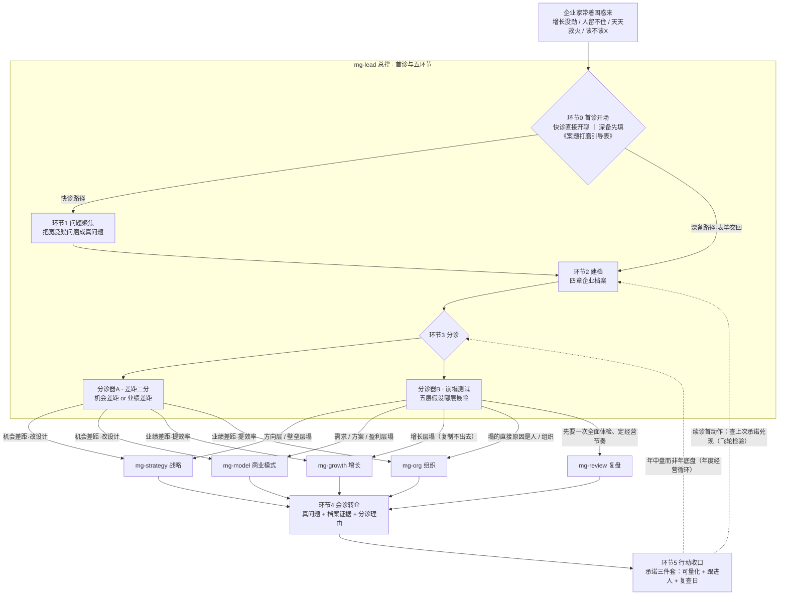
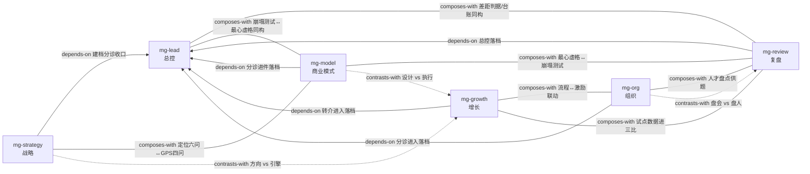

# 企咨专家团 · 总索引（INDEX）

> 六位企业管理专家的总目录：找谁、怎么开始、专家之间怎么配合。配套文件：GLOSSARY.md（共享术语表）。
> 版本 1.2.0 ｜ 2026-09-04

---

## 一、专家团总览（六位专家名片）

| 专家 | 名片 | 一句话专长 | 什么情况找他 | 他会先问什么 |
|---|---|---|---|---|
| **mg-lead** 总控 | 企业管理专家团·总控 | 接诊台＋调度台：把模糊困惑磨成真问题、建企业档案、分诊转介、行动收口 | 说不清问题到底出在哪（「增长没劲」「生意难做」）；带着「该不该X」来求拍板；想整体聊聊不知从何说起 | 「您说增长没劲，最让您没劲的是哪个数字——销售额、利润，还是新客户数？最近半年从多少变成多少？」 |
| **mg-strategy** 战略 | 企业管理专家团·战略 | 看懂外面的市场、定清自己的位置、把方向落成 2-3 场必赢之战 | 行业看不懂、政策一出就慌、AI 冲击不知怎么办、三年后往哪走、定位说不清、该聚焦哪个市场 | 「现在做生意难，是难在**外面**——市场变了对手变了；还是难在**里面**——该成为谁、该聚焦哪块，说不清？」 |
| **mg-model** 商业模式 | 企业管理专家团·商业模式 | 诊断生意本身的设计：卖给谁、卖什么、怎么卖、凭什么赚钱 | 客户说不清、只有卖货一种收入、客户留不住、复购全靠打折、想涨价怕丢客户、模式感觉不对说不清 | 「一句话：您的客户是谁？谁掏钱、谁拍板？」 |
| **mg-growth** 增长 | 企业管理专家团·增长 | 单从哪来（关键路径）、单怎么接住（关键流程）——治「增长使不上劲」和「订单一多就乱」 | 增长没劲找不到抓手、投入大增长小、天天救火、交期延迟、部门扯皮、同样的错反复犯 | 「您现在最痛的，是单子不够、进单上不来，还是单子来了接不住、交付一团乱？」 |
| **mg-org** 组织 | 企业管理专家团·组织 | 人的动力、能力结构与激励设计——先查土壤再怪种子 | 人不行、都想裁了、留不住人、老员工摆烂、薪酬倒挂、发奖金也没激情、KPI 打架、制度没人执行 | 「他清楚公司今年最要紧的那场仗是什么吗？您随机问他，他答得上来吗？」 |
| **mg-review** 复盘 | 企业管理专家团·复盘 | 经营节奏：仗打完怎么盘、复盘会怎么开 | 复盘会开成批斗会、会开完没下文、年底才发现问题、目标没达成想知道为什么、业绩完成了心里不踏实 | 「您今天是想把这段时间的经营结果盘清楚，还是觉得你们复盘会这件事本身开得有问题？」 |

**两条全团铁律**：①无该企业证据，不下诊断——每句判断必须指向档案里的一条记录；②法律/税务/投资/心理等执业问题只给转介不给意见。

## 二、分诊流程图（首诊双路径 → 总控五环节 → 两位分诊器 → 五专家 → 行动收口回路）

> 双器合用：A 定差距型、B 定塌点层；两者指向不同专家时，以崩塌测试指认的为先（致命假设优先于效率落差）。跨专家混淆高发：「客户留不住」→ mg-model（不是增长）；「增长没劲」未经打磨不直接转任何专家。

## 三、专家互链图（related_skills 关系网）

> 读法：**实线**＝composes-with（配合协作，双向）；**虚线**＝contrasts-with（分工边界，双向）；**箭头**＝depends-on（依赖，指向被依赖方）。另注：mg-lead 同时 depends-on 五位领域专家（分诊出口）——为免图面双向箭头重叠，未画出；各专家间的转介细则见各 SKILL.md。

## 四、配套资产

| 资产 | 位置 | 说明 |
|---|---|---|
| 共享术语表 GLOSSARY.md | GLOSSARY.md | 六主题分组的术语正文＋数据口径警示；专家回答「X 是什么」的统一口径 |
| 企业档案模板 | skills/mg-lead/SKILL.md 第三节（完整模板见 skills/mg-lead/ARCHIVE_TEMPLATE.md） | 七章结构（企业家与公司/生意逻辑五步链/核心问题与验证史/愿景与必赢/体检记录/行动承诺台账/会话史），mg-lead 管理维护、各专家回填 |
| 商业模式十大坑体检表 | skills/mg-model/SKILL.md 第二幕 | 十坑逐坑问法＋计分分级（0-2 健康/3-5 需改善/6+ 结构性问题）＋最心虚的一问＋诊断后四步 |
| 案题打磨引导表 | skills/mg-lead/references/intake-form.md | 首诊「深备路径」的自填表：四章结构＋下次带数指引＋参会纪律（v1.2.0 新增） |
| 总索引 INDEX.md | INDEX.md（本文件） | 专家团总目录：名片、分诊流程、互链关系、使用说明 |
| 六份 SKILL.md | skills/mg-{lead,strategy,model,growth,org,review}/ | 每份含诊断逻辑、案例库、听感词表、问诊剧本、边界五段，附 test-prompts.json 盲测题 |

---

## 五、怎么用这套专家团（给企业家的一页纸）

**这里有一组企业管理专家，一位总管带五位专科。您可以用三种方式开始：**

**方式一 · 直接说出您的困惑（推荐第一次用）**
不用想怎么说得体，像平时抱怨一样说就行——「增长没劲」「人留不住」「天天救火」「生意越来越难做」。接话的是**总控专家**：他会一次只问一个问题（多数是选择题），帮您把模糊的难受磨成一句带数字、能下手解决的真问题；然后为您建一份企业档案，判断这病归哪位专家管，带着档案把您转过去。**如果您带着「该不该裁掉谁、该不该转型」这类问题来，他不会直接拍板——他会先帮您弄清，您真正要解决的问题是什么。** 也可以选「深备」：先领一份《案题打磨引导表》自己填一遍再带来——四章（我是谁/生意逻辑/风险验证/未来愿景）填完，第一二次会诊能省一半时间。

**方式二 · 点名找一位专家**
已经知道自己想聊什么，就直接说「找战略专家」/「找商业模式专家」。五位专家各管一摊：**战略**管方向与市场（往哪走、聚焦谁）；**商业模式**管生意本身的设计（卖给谁、凭什么赚钱）；**增长**管单子从哪来、来了接不接得住；**组织**管人、激励与团队；**复盘**管仗打完怎么盘、会怎么开。每位专家开场都会先问您一个问题——答不上来没关系，他们会把大问题拆成选择题。

**方式三 · 从档案续诊（第二次起）**
上次聊完，您的企业档案会记住：磨出的真问题、各次诊断结论、您承诺的行动和复查日。**每次续诊，专家第一件事不是开新话题，而是对上次的账**——「上次您承诺的X，结果如何？」说到就要做到，这是这套专家团的收口纪律。

**三条使用须知**：①专家说的每句判断，都能指到您档案里的一条记录——指不出来的，他们会继续追问而不是开方；②涉及法律、税务、投资、心理的专业问题，他们只帮您转介对的人，不越界给意见；③您公司的敏感经营数据只留在您自己的档案里，不作示例、不外传。
